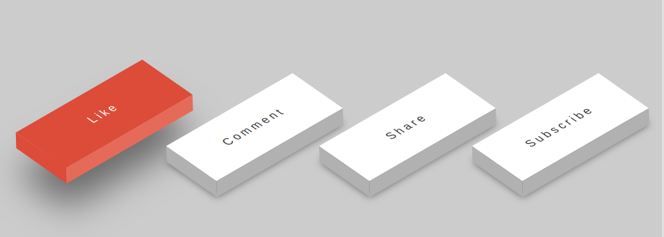
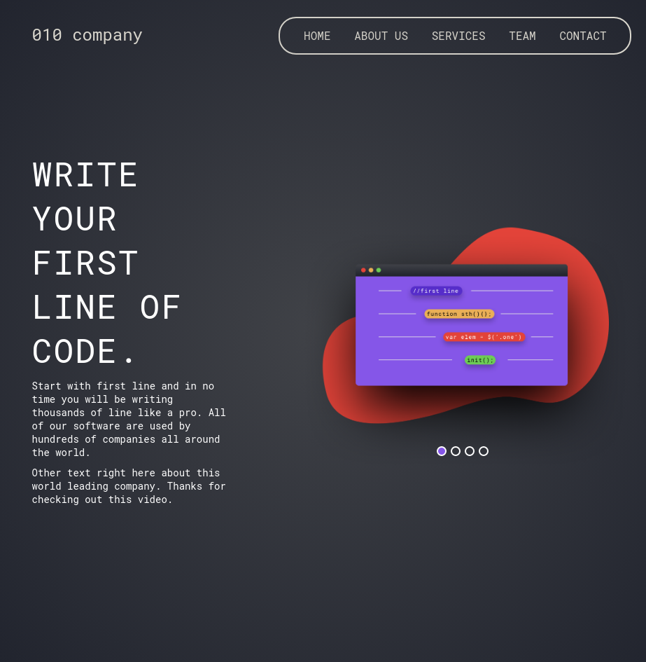
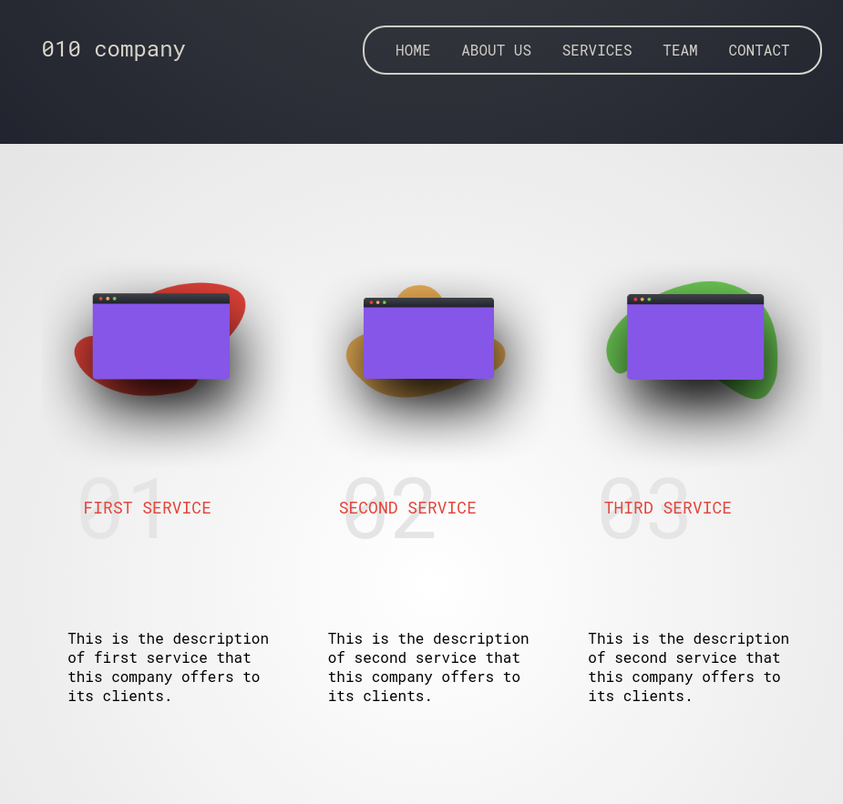
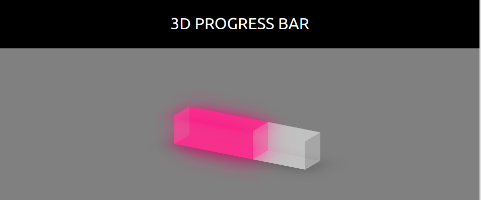
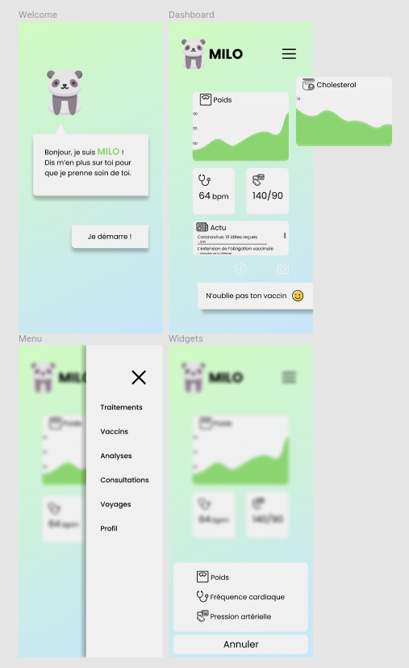

# 20 DAYS OF CODE CHALLENGE

_The goal is to build one small project every single day for 20 days consecutively._
I've committed to this challenge to force my way out of the tutorial hell :imp:

### Projects:

**3D Buttons:**

**010company landing page:**

**3D Progress Bar**

**Health App Mockup (Hackathon):**

**Parallax Effect:**

### Why ?

At the end I'll anounce and start **freelancing** :fire::fire::fire:

### What ?

Those projects are mainly **HTML & CSS** _(sometimes a bit of vanilla **JS**)_ snippets.

### Conclusion

It helped me realise that I can already build amazing websites in a short amount of time. But I can also learn new thing quickly.
Try it and boost your confidence to undertake next level project :muscle:
